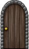

# Final Project - Advanced Programming Techniques

## Basics

This section explains how to play the game.

This is you:


You can move around using the ```WASD``` keys.

Go over an enemy to attack.


Killing an enemy squishes it.


Go over an fish platter to heal.


Go over a door to go to another level. Go over it gain to go back!



## Enemy types

The pink enemy applies poison which damages both you and it.


The eye-patched enemy is a necromancer and teleports to the corpse of fellow dead enemies and resurrects itself there.


## Views

You can switch tabs (by clicking them or using ```Ctrl``` + ```tab```) to switch views. Type help on the text user interface to see list of available commands.

### Graphical View

#### Overlay

You can set overlays for each level within the settings window. This can then be toggled from the toolbar. Do make sure to load a new game first!

#### Tileset

A universal tileset can also be set through the settings window. Simply create a file with the following syntax:
```
<low1> <high1> <file1>
<low2> <high2> <file2>
...
```

And point to it on the settings window. It can then be toggled from the toolbar in the GUI.

#### Zoom

Use ```Ctrl``` + ```+``` to zoom in on the GUI and ```Ctrl``` + ```-``` to zoom out.